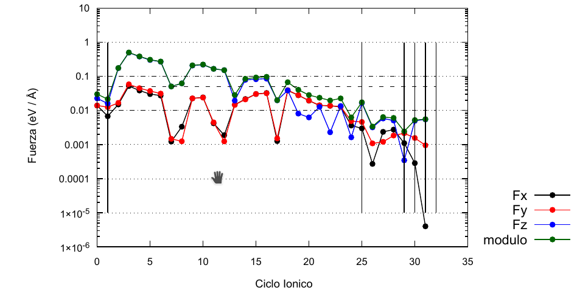

Vasp Forces Plotter
========================

this is not a program but a collection of sctipts. actually bash and gnuplot scripts, which
you should copy into a directory with files coming from your calculations.
For example if you made several calculation steps, in each step you should pack your
contcar, outcar, oszicar the following way:

for each calculation step:
```{bash}
tar -czhf OUT-OSZ-CON-$step.tar.gz OUTCAR CONTCAR OSZICAR
```

and then on a separate directory you shoud have

```{bash}
OUT-OSZ-CON-0.tar.gz
OUT-OSZ-CON-1.tar.gz
.
.
.
OUT-OSZ-CON-<N-1>.tar.gz
OUT-OSZ-CON-<N>.tar.gz
```
and then copy all the scripts into the directory, and finally run 

```{bash}
$bash proceso.sh
```

if everything goes right you should get a multipage pdf with one plot for each atom for the three components
of the total force as a function of the ionic step. hlines for tolerances are fixed in the script:




Also, labels are in spanish. feel free to translate! 

# Prerequisites:

- gnuplot for plotting
- pdftk for table of contents
- bash
